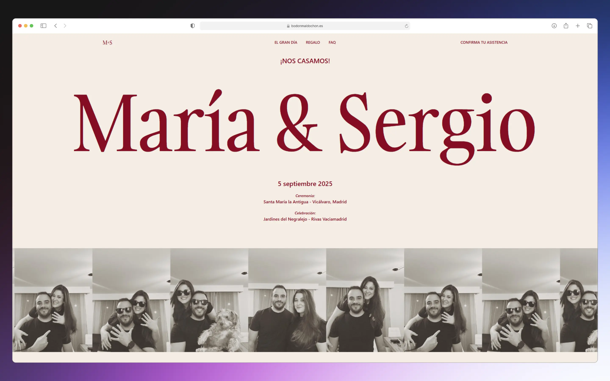

    <a href="https://bodonmaldochon.es" target="_blank">
        Website
    </a>
    &nbsp;❖&nbsp;
    <a href="https://github.com/juliandpt/boda-maria-y-sergio?tab=readme-ov-file#-about">
        About
    </a>
    &nbsp;❖&nbsp;
    <a href="https://github.com/juliandpt/boda-maria-y-sergio?tab=readme-ov-file#-stack">
        Stack
    </a>
    &nbsp;❖&nbsp;
    <a href="https://github.com/juliandpt/boda-maria-y-sergio?tab=readme-ov-file#-contact">
        Contact
    </a>

> [!WARNING]
> This page is a work in progress.
> Needs to be updated with the latest information regarding the wedding celebration.

## ℹ️ About

This website is designed as an informational page for the wedding celebration between María and Sergio. It includes:

- Information about the ceremony and reception
- Schedule details
- Reservation link for guests
- transportation information
- Frequently asked questions section

## 📦 Stack

- [**Astro**](https://astro.build/) - Web development for the rest of us.
- [**Typescript**](https://www.typescriptlang.org/) - JavaScript with syntax for types.
- [**Tailwindcss**](https://tailwindcss.com/) - A utility-first CSS framework for rapidly building custom designs.
- [**Prettier**](https://prettier.io/) - An opinionated code formatter.

## ✉️ Contact

If you have any questions or comments, please feel free to contact me via [Twitter](https://twitter.com/depabloj) or [GitHub](https://github.com/juliandpt).

